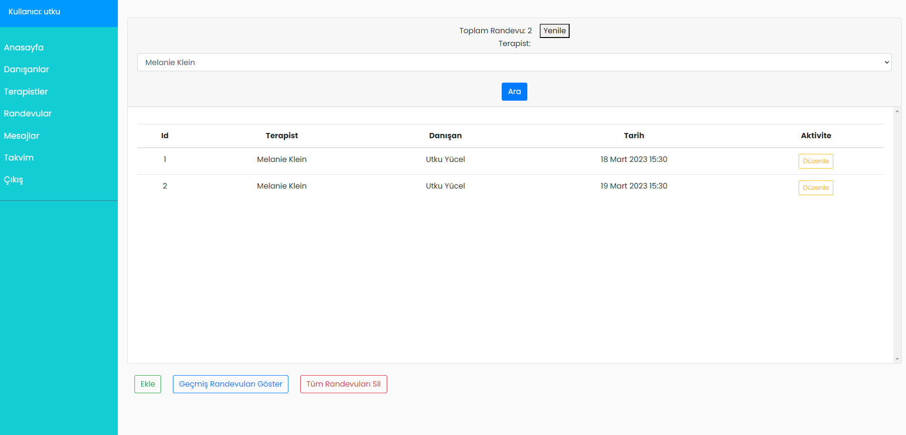

# Therapist Appointment App

This is a Django3 web application designed to help therapists manage their appointments and communicate with their clients.

## Features

- **Login Page**: Users can log in to access the main page.
- **Main Page**: The main page displays the user's appointments for the day and upcoming appointments.
- **Clients**: Users can view a list of their clients and add new clients.
- **Therapists**: Users can view a list of all therapists in the system.
- **Therapists (Detail)**: Users can view details about a specific therapist, including their contact information.
- **Appointments**: Users can view, create, edit, and delete appointments.
- **Broadcast Message**: Users can send a broadcast message to all of their clients.
- **Calendar**: Users can view their appointments in a calendar view.

## Screenshots

Here are some screenshots of the different pages in the application:

### Login Page

### Main Page

### Clients

### Therapists

### Therapists (Detail)

### Appointments

### Broadcast Message

### Calendar

## Installation

To install and run the application, follow these steps:

1. Clone the repository: `git clone https://github.com/your-username/therapist-appointment-app.git`
2. Create a virtual environment: `python3 -m venv env`
3. Activate the virtual environment: `source env/bin/activate`
4. Install the requirements: `pip install -r requirements.txt`
5. Run the migrations: `python manage.py migrate`
6. Create a superuser: `python manage.py createsuperuser`
7. Start the development server: `python manage.py runserver`

You can now access the application by visiting `http://localhost:8000` in your web browser.

## Configuration

The application uses the following environment variables for configuration:

- `SECRET_KEY`: A secret key used for cryptographic signing.
- `DEBUG`: Set to `True` to enable debug mode.
- `DATABASE_URL`: The URL of the database to use (defaults to a SQLite database).
- `EMAIL_HOST`: The hostname of the SMTP server to use for sending emails.
- `EMAIL_PORT`: The port number of the SMTP server to use (defaults to 587).
- `EMAIL_HOST_USER`: The username to use for authenticating with the SMTP server.
- `EMAIL_HOST_PASSWORD`: The password to use for authenticating with the SMTP server.
- `EMAIL_USE_TLS`: Set to `True` to use TLS when sending emails.

You can set these environment variables using a `.env` file or by exporting them in your shell.

## Contributing

If you'd like to contribute to the project, please follow these steps:

1. Fork the repository.
2. Create a new branch: `git checkout -b my-feature-branch`
3. Make your changes and commit them: `git commit -m "Add a new feature"`
4. Push your changes to your fork: `git push origin my-feature-branch`
5. Create a pull request.

## License

This project is licensed under the MIT License. See the `LICENSE` file for more information.
